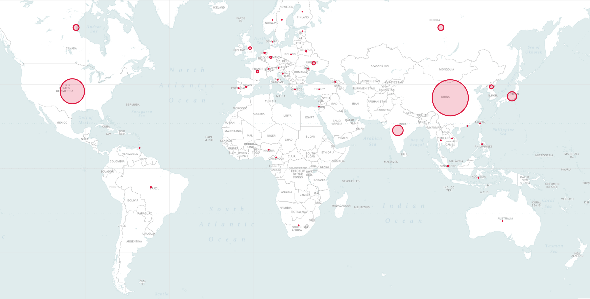

# Github Star Gazers Analytics

Get to know a GitHub repository's star-gazers, by using some simple analytics and visualizations of star-gazers data queried from GitHub.

<center> </center>

Choose any github repository, run a query against GitHub to download the star-gazer records, and perform analytics.
Currently features:
- Classify star-gazers by country of origin, and draw this using size-bubbles on a world map.
- Create monthly starring activity statistics
- Create day-of-week statistics

**Note**: You will need a GitHub user and password to query GitHub.  There is an API to query without using GiutHub credentials, but it limits the number of queries to a very small number, that is not practical for this application.

## Installation

These instructions will help get Distiller up and running on your local machine.
1. [Clone Star Gazers Analytics](#clone-star-gazers-analytics)
2. [Create a Python virtual environment](#create-a-python-virtual-environment)
3. [Install dependencies](#install-dependencies)

Notes:
- This repository has only been tested on Ubuntu 16.04 LTS, and with Python 3.5.

### Clone Star Gazers Analytics
Clone the Star Gazers Analytics code repository from github:
```
$ git clone https://github.com/netaz/github_stars_analytics.git
```

### Create a Python virtual environment
I recommend using a [Python virtual environment](https://docs.python.org/3/library/venv.html#venv-def), but that of course, is up to you.
Before creating the virtual environment, make sure you are located in directory ```github_stars_analytics```.  After creating the environment, you should see a directory called ```github_stars_analytics/env```.
<br>
#### Using virtualenv
If you don't have virtualenv installed, you can find the installation instructions [here](https://packaging.python.org/guides/installing-using-pip-and-virtualenv/).

To create the environment, execute:
```
$ python3 -m virtualenv env
```
This creates a subdirectory named ```env``` where the python virtual environment is stored, and configures the current shell to use it as the default python environment.

#### Using venv
If you prefer to use ```venv```, then begin by installing it:
```
$ sudo apt-get install python3-venv
```
Then create the environment:
```
$ python3 -m venv env
```
As with virtualenv, this creates a directory called ```distiller/env```.<br>

#### Activate the environment
The environment activation and deactivation commands for ```venv``` and ```virtualenv``` are the same.<br>
**!NOTE: Make sure to activate the environment, before proceeding with the installation of the dependency packages:<br>**
```
$ source env/bin/activate
```

### Install dependencies
Finally, install Distiller's dependency packages using ```pip3```:
```
$ pip3 install -r requirements.txt
```

## Getting Started
1. Download some metadata
We need some metadata about each of the countries in the world: its capital, size of population and all of the major cities.
We also download for each country its longitude and latitude so we can draw country-specific data on a map.
We will use this data to match star-gazer records to countries.

We only need to download this data once:
```
$ ./download_metadata.sh
```

2. Query a specific Github repository and create a file (default name = star_gazers.csv) with the cached information.
This process is a bit slow so we cache the results in a file, until we decide to get new data.

```
python stars_analytics.py query-github --user=<YOUR-GITHUB-USERNAME> --password=<YOUR-GITHUB-PASSWORD> --repo=<YOUR-GITHUB-REPO-URL>
```

The format of the URL is the same as when you access it via the web.  For example: https://github.com/NervanaSystems/distiller

3. Use the cached github star-gazers data file, to create analytics and visualizations.
For example:

```
python stars_analytics.py stars-map
```
